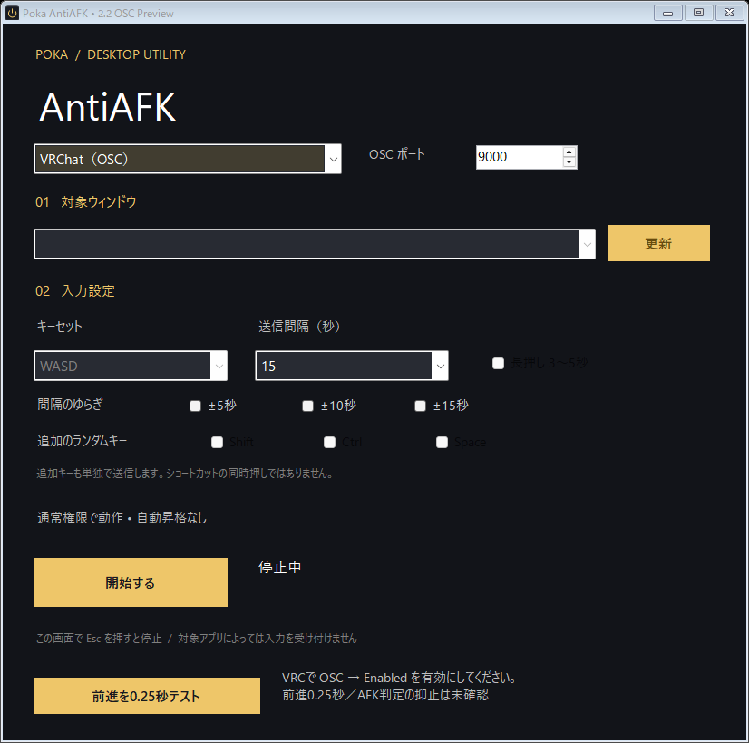

# Poka AntiAFK 2.2 OSC Preview

Windows向けAntiAFKユーティリティです。従来のウィンドウ入力に加え、VRChatの公式OSC入力に対応しました。

## 動作確認状況

開発者の実機確認（2026-09-21）に基づきます。

| 対象 | 入力方式 | 確認できたこと |
| --- | --- | --- |
| FINAL FANTASY XIV | 従来のウィンドウ入力 | 前回版で動作確認済み。2.2での再確認は未実施 |
| VRChat | OSC | 2.2で0.25秒の単発前進と「開始する」での定期動作を確認済み |

VRChatでは従来のウィンドウ入力は反映されなかったため、**VRChat（OSC）** を選んでください。AFK判定の抑止や長時間動作は、入力動作とは別に確認が必要です。

## VRChatで試す

1. VRChatを起動し、アクションメニューで **OSC → Enabled** を有効にします。
2. PokaAntiAFK.exeを通常起動し、上部の方式を **VRChat（OSC）** にします。
3. OSCポートは通常 **9000** のままで使います。VRChat側の受信ポートを変更した場合だけ合わせてください。
4. 周囲に余裕のある場所で **前進を0.25秒テスト** を押し、VRC内で前進するか確認してください。
5. 単発動作を確認できたら、送信間隔を選んで **開始する** を押します。最初の送信まで設定間隔（初期値15秒）だけ待ち、その後も指定間隔ごとに0.25秒の前進入力を送ります。

OSCモードは従来の対象ウィンドウ、キーセット、追加キー、長押し設定を使いません。送信先は同じPCの127.0.0.1に限定しています。間隔のゆらぎは使用できます。停止・終了時には、このアプリが押している前進入力の解除を送ります。

UDPには受信確認がないため、「送信完了」はVRC側での動作成功を保証しません。OSC無効・ポート不一致・VRC未起動でも、送信処理自体は成功する場合があります。パケット消失やアプリの強制終了時は解除が届かない場合があります。

VRChatで単発・定期の入力動作を確認済みです。AFK判定の抑止は未確認です。テスト用受信先でもOSCアドレス・整数型・バイト順・押下と解除・単発の自動停止・停止時と終了時の解除を確認しました。従来方式の9項目も合格しています。

公式仕様: [OSC入力](https://docs.vrchat.com/docs/osc-as-input-controller)、[OSCの有効化とポート](https://docs.vrchat.com/docs/osc-overview)。

Windowsの指定したウィンドウに、一定間隔でキー入力を送るユーティリティです。日本語UI・通常権限起動・停止時のキー解放に対応しています。

**現在は試用版です。** 対象アプリごとの互換性は保証していません。

[ダウンロード（2.2 OSC Preview）](https://github.com/Pokahina-ta/PokaAntiAFK/releases/tag/v2.2.0-preview.1)

## 使い方

1. ZIPを展開し、PokaAntiAFK.exeを通常起動します。
2. 対象ウィンドウを選びます。同じタイトルはPIDで区別できます。「更新」で再取得します。
3. キーセットと送信間隔を選び、「開始する」を押します。
4. 「停止する」、この画面にフォーカスがある状態でEsc、または画面を閉じると停止します。

送信するキーはWASDまたはESDFから毎回1つ選びます。Shift・Ctrl・Spaceを有効にすると、そのキーも抽選候補に入ります。同時押しではありません。長押し無効時は100ms、有効時は3〜5秒です。送信間隔はキー解放から次の押下までの時間です。ゆらぎは15/30/60秒で有効、最短間隔は1秒です。対象の消失は次の送信・解放時に検出します。

## 権限と動作範囲

- 起動マニフェストは `asInvoker`、`uiAccess=false`。管理者権限の要求・自動昇格・権限制限の回避は実装していません。
- 管理者として手動起動した場合や、管理者プロセスから起動した場合は権限を引き継ぎ、画面にその状態を表示します。権限を自動で下げる機能はありません。
- 相手との権限差で送信が拒否された場合は停止して理由を表示します。通常権限で使える対象で試してください。
- 起動直後は停止状態です。バックグラウンド常駐、自動起動、データ収集、設定の永続保存はありません。OSCモードでは同じPCへのUDP送信を行います。
- 従来方式は選択したウィンドウへのWindowsメッセージ送信です。OSC方式を含め、送信成功は対象アプリが入力として処理したことを保証しません。
- キー解放に失敗した場合は再開を無効化します。対象アプリの状態を確認してください。アプリの強制終了やOS障害時のキー解放は保証できません。
- PCのスリープ防止機能ではありません。使用先のルールに沿って利用してください。

Microsoft仕様: [PostMessageと権限差](https://learn.microsoft.com/en-us/windows/win32/api/winuser/nf-winuser-postmessagew)、[起動マニフェスト](https://learn.microsoft.com/en-us/windows/win32/sbscs/application-manifests)。

## 動作環境・ビルド

Windows / .NET Framework 4.8。開発環境上で確認済みですが、Windowsバージョン別の互換性試験は未実施です。実行ファイルは外部UIライブラリに依存しません。

ビルドには.NET SDKと.NET Framework 4.8 Developer Packを用意し、`build.ps1`を実行します。Visual Studio用の `PokaAntiAFK.csproj` も同梱しています。

Windowsの開発環境で `tests/run.ps1` を実行すると、専用のテストウィンドウを使って動作確認できます。結果と画面描画は `TestResults/` に出力されます。

## 確認できたこと

テスト専用のウィンドウに対して、対象なしでの開始禁止、実行中の対象変更禁止、長押し中の非ブロッキング動作、キー押下送信、停止時の即時解放、キー解放メッセージのフラグ、停止後の操作復帰、対象終了時の停止、アプリ終了時の解放の9項目を自動確認。画面を描画して表示の確認も実施しました。

## 試用版の制限・今後の確認事項

- FFXIVの2.2での再確認、および未掲載のゲーム・アプリでの互換性確認。
- 標準ユーザー／管理者の組合せによる実機試験。送信拒否のエラー処理は実装済みですが、UAC境界をまたぐ実機試験は未実施です。
- 別PC、高DPI、長時間実行での検証。
- ソースコードのライセンス方針は未設定です。公開していることをもって、改変・再配布の包括的な許諾を与えるものではありません。
- この試用版は未署名です。

従来のReaLTaiizor依存と同梱アイコンは、この版では使っていません。黒とゴールドの電源マークを専用アイコンとして、exeとウィンドウに埋め込んでいます（16〜256pxの7サイズ）。
